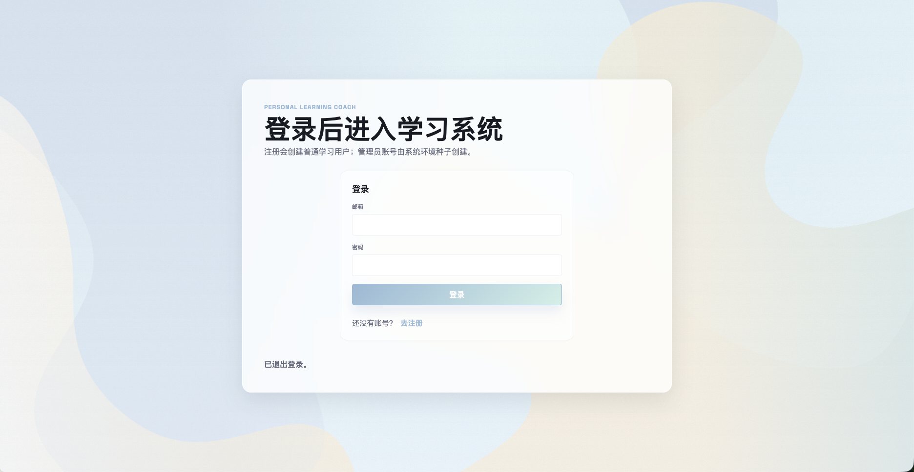
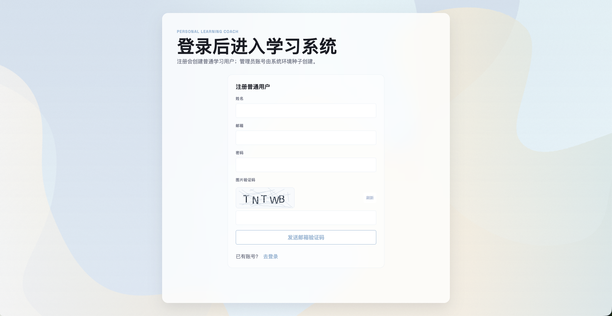
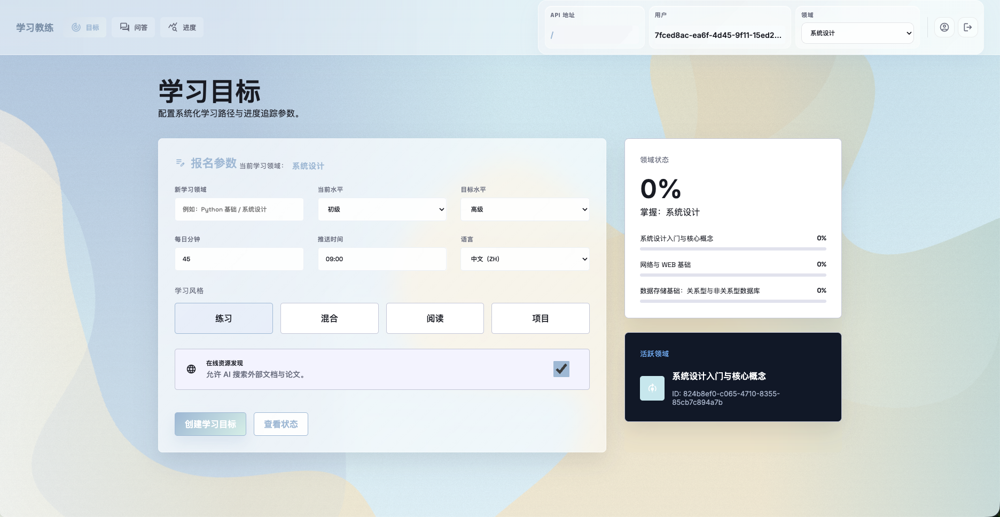
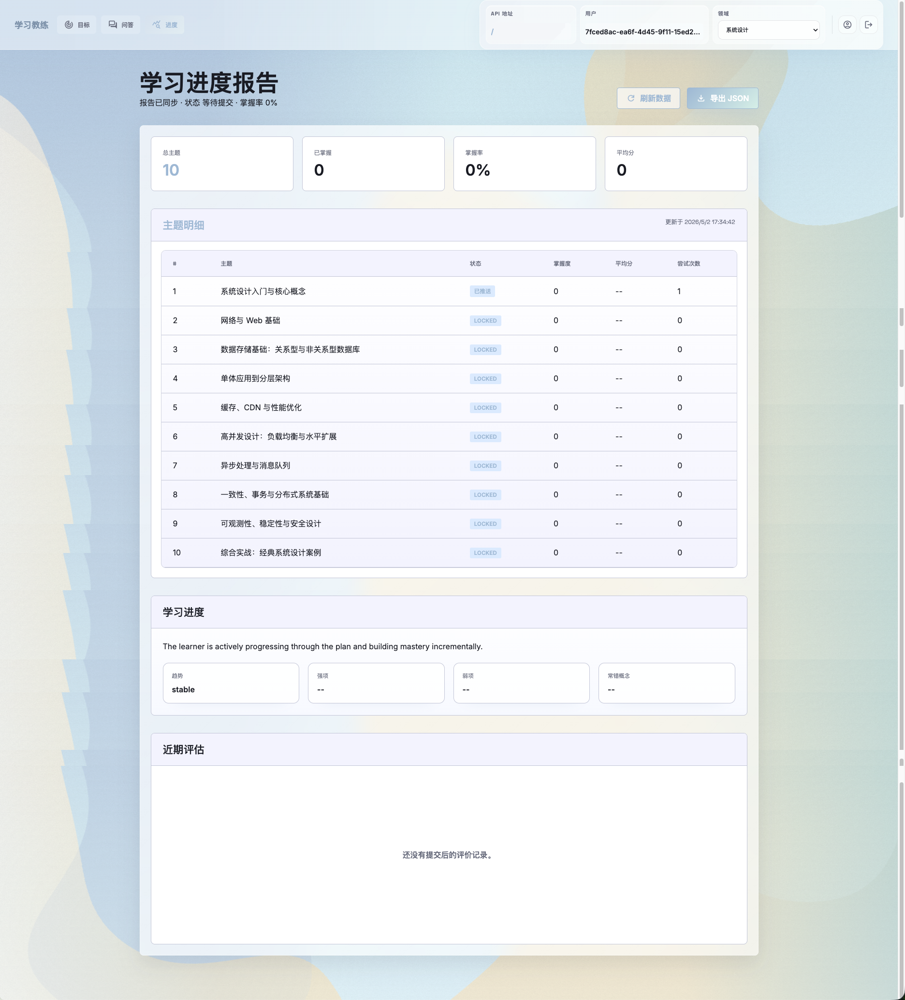
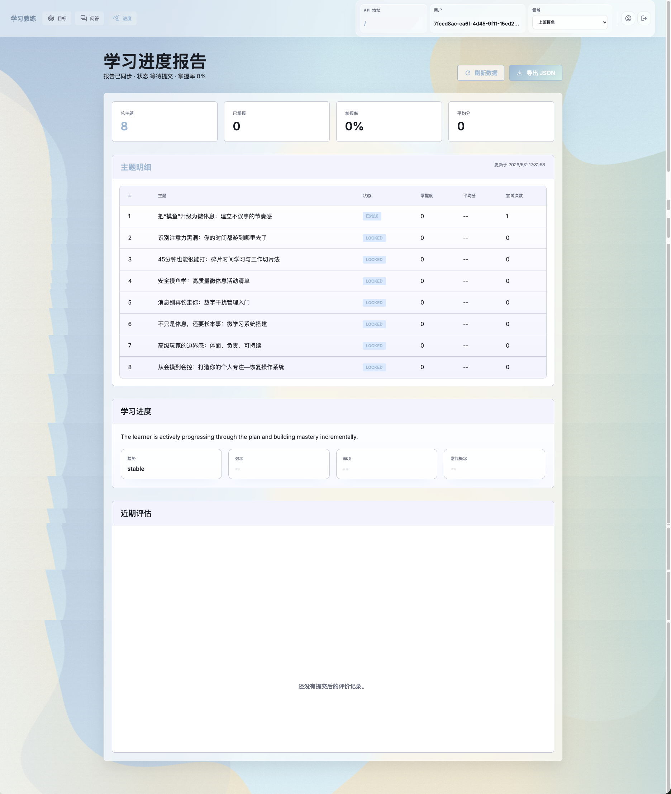
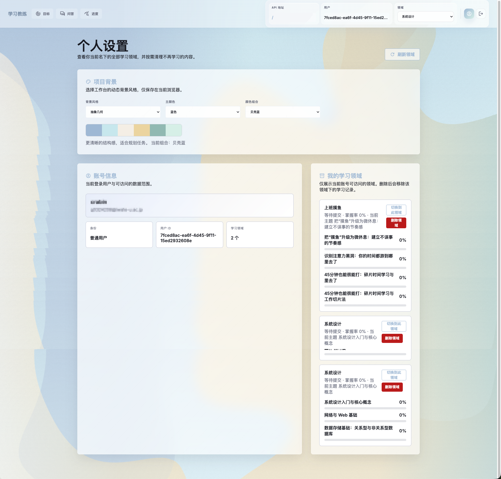

# Personal Learning Coach

一个以 **前端 Web 工作台** 为主要入口的个人 AI 学习教练项目。

它围绕“报名学习领域 → 生成每日问题 → 提交答案 → 自动评估 → 查看学习报告 → 进入复习/结业评估”构建完整学习闭环，并同时提供：

- 前端 Web 界面
- FastAPI HTTP 接口
- CLI 命令行工具
- 管理员备份、恢复、用户与领域管理能力

## 适合谁

这个项目更适合下面两类使用方式：

1. **普通学习用户**：通过浏览器完成登录、创建学习目标、回答每日问题、查看报告
2. **管理员/开发者**：通过浏览器管理用户和领域，通过 API / CLI 调试与运维

如果你只是想尽快体验项目，**推荐直接走前端 Web 工作台**，不要先从 CLI 开始。

## Web 运行截图

### 登录与注册





### 学习目标



### 每日学习工作台


### 学习进度报告





### 个人设置



## 核心能力

### 学习侧

- 用户注册、登录、退出、会话保持
- 创建学习领域与学习目标
- 根据当前水平和目标水平生成学习计划
- 获取当天学习内容：理论、基础题、实践题、复盘题
- 提交答案并获得自动评估
- 查看结构化学习报告与近期评估结果
- 自动识别复习阶段与结业评估阶段
- 个人设置页查看和删除自己名下的学习领域

### 管理侧

- 管理员查看全部用户
- 管理员查看指定用户的学习领域
- 管理员归档 / 重置 / 删除学习领域
- 系统备份与恢复
- 运行事件与告警查看

## 项目结构

```text
src/personal_learning_coach/
  api/                FastAPI 入口与路由
  coach.py            CLI 入口
  config.py           环境变量与运行配置
  data_store.py       本地 SQLite 数据存储
  plan_generator.py   学习计划生成
  evaluator.py        作答评估
  report_generator.py 学习报告生成
src/web/              前端 Web 工作台（Vite + TypeScript）
data/                 运行期数据目录
tests/                后端测试
```

## 技术栈

### 后端

- Python 3.12+
- FastAPI
- Pydantic v2
- SQLite
- OpenAI SDK

### 前端

- Vite
- TypeScript
- 原生单页应用结构

## 快速开始

### 1. 安装后端依赖

推荐使用 `uv`：

```bash
uv sync --dev
```

如果你不用 `uv`：

```bash
python -m venv .venv
source .venv/bin/activate
pip install -e ".[dev]"
```

### 2. 配置环境变量

先复制环境变量模板：

```bash
cp .env.example .env
```

最小配置如下：

```env
OPENAI_API_KEY=sk-...
OPENAI_MODEL=gpt-4.5
OPENAI_BASE_URL=
DATA_DIR=./data
DELIVERY_MODE=local
LOG_LEVEL=INFO
```

如果你需要前端里登录管理员账号，还需要增加种子管理员配置：

```env
ADMIN_SEED_EMAIL=admin@example.com
ADMIN_SEED_PASSWORD=change-this-password
ADMIN_SEED_NAME=System Admin
```

可选配置：

```env
API_AUTH_TOKEN=
ADMIN_READ_TOKEN=
ADMIN_WRITE_TOKEN=
BACKUP_DIR=./data/backups
```

如果你使用 OpenAI 兼容网关：

```env
OPENAI_BASE_URL=https://your-openai-compatible-endpoint/v1
```

如果你希望把学习内容投递到 Telegram：

```env
DELIVERY_MODE=telegram
TELEGRAM_BOT_TOKEN=...
TELEGRAM_CHAT_ID=...
```

## 推荐使用路径：先启动后端，再启动前端

### 1. 启动后端 API

```bash
uv run coach-api
```

旧入口 `personal_learning_coach.api.main:app` 仍保留兼容。
默认后端会绑定到 `127.0.0.1:8000`，仅允许本机访问；局域网内设备通过前端开发服务器代理访问后端。可以通过环境变量覆盖：

```bash
API_HOST=0.0.0.0 API_PORT=8000 API_RELOAD=true uv run coach-api
```

启动后可访问：

- Swagger 文档：`http://127.0.0.1:8000/docs`
- 健康检查：`http://127.0.0.1:8000/health`

### 2. 启动前端 Web 工作台

```bash
cd src/web
npm install
npm run dev
```

默认前端地址：

- Web 工作台：`http://127.0.0.1:5173` 或 `http://<本机局域网 IP>:5173`

前端开发服务器默认绑定到 `0.0.0.0:5173`，允许局域网内设备访问，并内置代理把这些请求转发到本机后端 `http://127.0.0.1:8000`：

- `/health`
- `/auth`
- `/domains`
- `/schedules`
- `/submissions`
- `/reports`
- `/admin`
- `/data`

如果你的后端不在默认地址，可以在启动前端前设置：

```bash
VITE_API_PROXY_TARGET=http://127.0.0.1:8000 npm run dev
```

如果局域网访问时提示 host 不被允许，可以把本机名加入允许列表：

```bash
VITE_ALLOWED_HOSTS=crabins-macbook npm run dev
```

## 前端使用说明

### 普通用户黄金路径

1. 打开 `http://127.0.0.1:5173`
2. 注册普通用户，或使用已有账号登录
3. 在“学习目标”页创建一个学习领域
4. 切到“每日学习工作台”获取今日问题
5. 填写基础题、实践题与反思内容并提交
6. 切到“学习进度报告”查看掌握率、主题明细与近期评估
7. 在“个人设置”中查看或删除自己名下的学习领域

### 管理员黄金路径

1. 在 `.env` 中设置 `ADMIN_SEED_EMAIL` 和 `ADMIN_SEED_PASSWORD`
2. 重启后端服务
3. 用该管理员账号登录前端
4. 进入“管理与运维”页执行：
   - 查看用户列表
   - 查看某个用户的学习领域
   - 归档 / 重置 / 删除领域
   - 创建备份 / 恢复备份
   - 查看运行事件与告警

### 前端页面说明

- **学习目标**：创建领域、设置当前水平 / 目标水平 / 每日学习时间 / 学习风格
- **每日学习工作台**：获取当天理论、基础题、实践题、复盘题并提交答案
- **学习进度报告**：查看主题明细、掌握率、近期评估与阶段总结
- **个人设置**：查看当前账号名下的全部学习领域
- **管理与运维**：仅管理员可见，用于系统级操作

## API 使用

如果你不走前端，也可以直接调用 API。

### 创建学习领域

```bash
curl -X POST http://127.0.0.1:8000/domains/ai_agent/enroll \
  -H "Content-Type: application/json" \
  -d '{
    "user_id": "u1",
    "level": "beginner",
    "target_level": "advanced",
    "daily_minutes": 45,
    "learning_style": "practice",
    "delivery_time": "20:30",
    "language": "zh",
    "allow_online_resources": true
  }'
```

### 获取学习报告

```bash
curl "http://127.0.0.1:8000/reports/ai_agent?user_id=u1"
```

### 健康检查

```bash
curl http://127.0.0.1:8000/health
```

## 认证说明

### 用户认证

前端登录与注册使用以下接口：

- `GET /auth/register/captcha`
- `POST /auth/register/start`
- `POST /auth/register/complete`
- `POST /auth/login`
- `POST /auth/logout`
- `GET /auth/me`

注册时需要先填写图片验证码，再接收邮箱验证码。邮箱验证码校验通过后，前端会自动保存 Bearer Token 并进入学习系统。

默认邮件发送配置使用 QQ 个人邮箱 SMTP。`SMTP_PASSWORD` 必须填写 QQ 邮箱“授权码”，不要填写 QQ 登录密码：

```env
SMTP_HOST=smtp.qq.com
SMTP_PORT=465
SMTP_USE_SSL=true
SMTP_USE_TLS=false
SMTP_USERNAME=your-qq-email@qq.com
SMTP_PASSWORD=your-qq-mail-authorization-code
SMTP_FROM_EMAIL=your-qq-email@qq.com
SMTP_FROM_NAME=Personal Learning Coach
SMTP_TIMEOUT_SECONDS=10
```

如果未配置 SMTP，注册发送邮箱验证码会返回服务不可用，账号不会被创建。

### 管理员权限

管理员有两种进入方式：

1. **推荐**：使用管理员账号登录前端
2. **兼容方式**：通过 `x-api-key` 调用管理接口

管理接口包括：

- `/admin/backup`
- `/admin/restore`
- `/admin/runtime-events`
- `/admin/alerts`
- `/admin/users`
- `/admin/users/{user_id}/domains`

## CLI 使用

项目也提供 `coach` 命令，适合脚本化调用和调试。

查看帮助：

```bash
uv run coach --help
```

常用命令：

```bash
uv run coach --user-id u1 plan --domain ai_agent --daily-minutes 45 --learning-style practice
uv run coach --user-id u1 push --domain ai_agent
uv run coach --user-id u1 submit --push-id <push_id> --answer "My answer"
uv run coach --user-id u1 report --domain ai_agent
uv run coach --user-id u1 final-assessment --domain ai_agent --passed --score 92 --feedback "Strong finish"
```

生命周期命令：

```bash
uv run coach --user-id u1 pause --domain ai_agent
uv run coach --user-id u1 resume --domain ai_agent
uv run coach --user-id u1 archive --domain ai_agent
uv run coach --user-id u1 delete-domain --domain ai_agent --confirm-delete
```

备份与恢复：

```bash
uv run coach backup
uv run coach restore --backup-path ./data/backups/20260428T120000Z
```

## 数据与输出

默认情况下：

- 结构化数据保存在 `DATA_DIR/personal_learning_coach.sqlite3`
- 本地推送内容保存在 `DATA_DIR/pushes/`
- 日志保存在 `DATA_DIR/logs/app.log`
- 备份目录默认是 `./data/backups`

## 开发检查

### 后端

```bash
uv run pytest -q
uv run ruff check .
uv run mypy src
```

### 前端

```bash
cd src/web
npm test
npm run build
```

## 已知注意事项

- 没有配置 `OPENAI_API_KEY` 时，学习计划生成、题目生成和评估功能无法正常工作
- `DELIVERY_MODE=telegram` 时必须同时配置 `TELEGRAM_BOT_TOKEN` 和 `TELEGRAM_CHAT_ID`
- 管理页面只有管理员用户可见
- 普通用户登录后默认只管理自己名下的数据
- 前端不会替你创建管理员账号；管理员账号来自后端启动时读取的种子环境变量

## 开发建议

如果你的目标是二次开发，建议按下面顺序理解项目：

1. 先跑通前端登录和学习流程
2. 再看 `src/personal_learning_coach/api/` 路由层
3. 然后看 `plan_generator.py`、`content_pusher.py`、`evaluator.py`、`report_generator.py`
4. 最后再看 CLI 与运维能力
